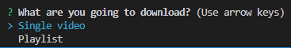
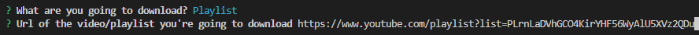
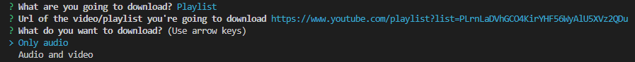

# Videos Downloader

Project based on [youtube-dl](https://github.com/ytdl-org/youtube-dl) that allows user download single videos or videos playlists in a simple way.

You can see all the platforms where you can download videos in [this link](http://ytdl-org.github.io/youtube-dl/supportedsites.html), some of the available platforms are Youtube, Twitter, Instagram, TikTok, Vimeo, Udemy and hundreds of other popular platforms.

## Prerequistes

> Python >= 3.7

> NodeJs >= 14

> Download [ffmpeg](https://ffmpeg.org/download.html) and move the ffmpeg, ffplay and ffprobe files inside the "ffmpeg" folder of this repository.

Install the required dependencies with ```npm install```

## Usage

You can run the program with ```npm start```, once it is running some questions will prompt on your terminal.

The first question will ask you if you are going to download a single video or a playlist


In the second question you have to input the url of the video or playlist you are going to download


Finally you will be asked if you want to download only the audio of the videos (it will be downloaded in .mp3) or if you want to download audio and video (.mp4)


Once the process have finished, you can check the ```downloads``` folder where you will see the downloaded files.

### Features

To download playlist it will use multithreading in order to optimise the download time. To do this it will split the playlist items and distribute them in all the cpu cores that are available in the system.

Eg: If your cpu has 4 cores, it will download 4 videos at once.
